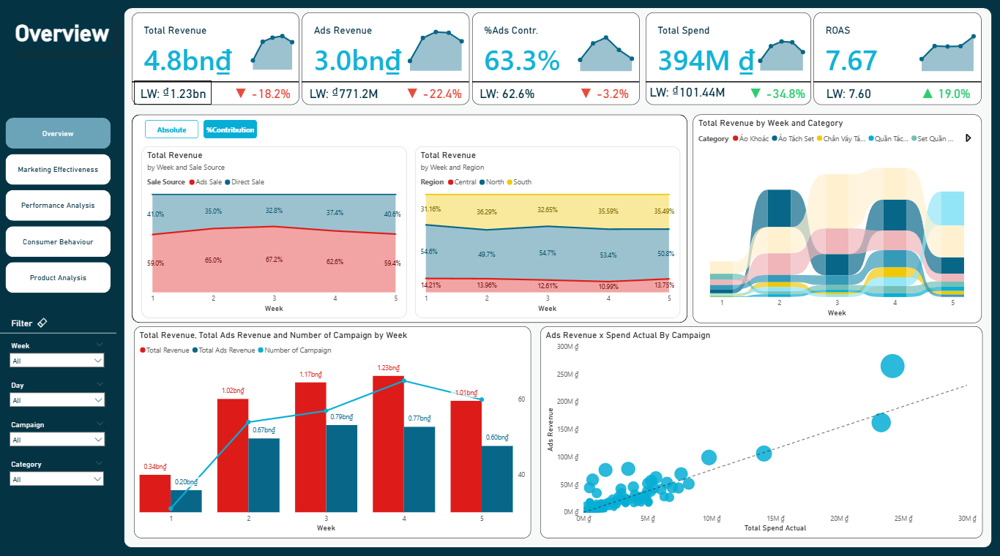
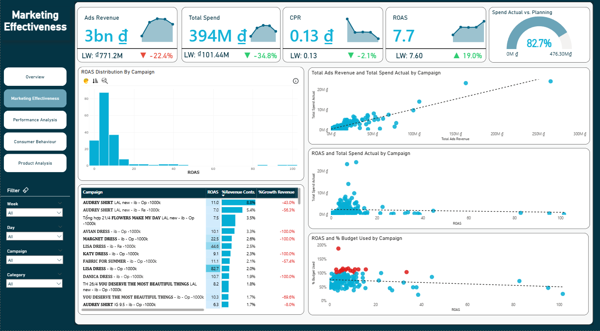
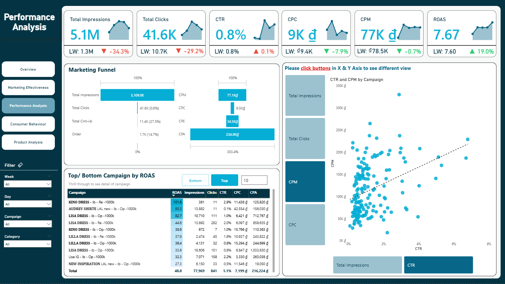
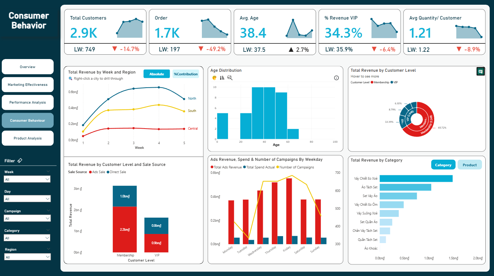
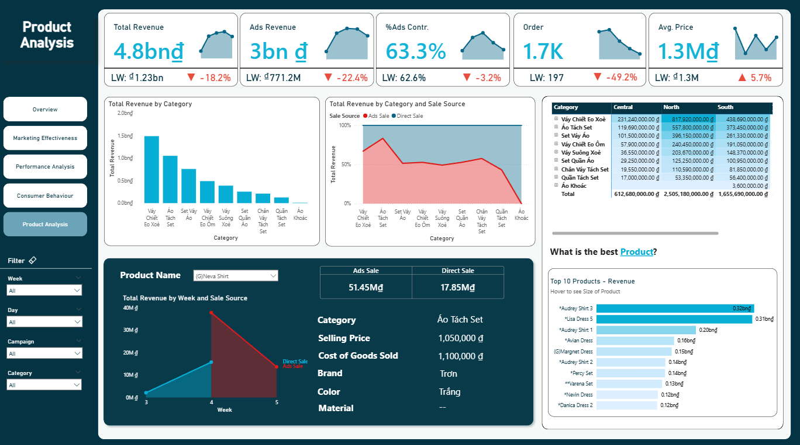

# 👗 Power BI – Fashion Company Marketing Analytics

## 📌 Project Overview
This project analyzes **marketing performance and sales impact** for a fashion company using **Power BI**.  
The analysis focuses on understanding **campaign effectiveness, revenue drivers, customer behavior, and product performance** to support data-driven marketing decisions.

**Industry:** Fashion Retail  
**Tools:** Power BI, DAX  
**Data Model:** Star Schema (Fact & Dimension tables)

---

## 🎯 Business Objectives
- Evaluate marketing campaign effectiveness (Ads vs Direct Sales)
- Understand revenue contribution by product, category, and region
- Analyze customer segments and purchasing behavior
- Measure marketing efficiency (CPC, CPM, ROAS)
- Support budget allocation and campaign optimization decisions

---

## 📦 Introduction to Dataset

The dataset is designed to support **marketing and sales analytics** and consists of **2 fact tables** and **multiple dimension tables**.

### 🔹 Fact Tables
1. **fact_mkt_camp_by_sku_cost**  
   - Campaign-level performance by SKU  
   - Includes revenue, ad cost, clicks, impressions, CPC, CPM  

2. **fact_order**  
   - Order-level revenue including **Ads-driven and Direct sales**  
   - Contains customer, product, discount, and pricing information  

### 🔹 Dimension Tables
- **dim_danh_sach_san_pham** – Product details and pricing  
- **dim_mkt_camp_cost** – Campaign metadata and cost metrics  
- **dim_date** – Date dimension for time analysis  
- **dim_productcategory** – Custom product categorization  
- **dim_region** – City-to-region mapping  
- **dim_unique_sku_by_campaign** – Mapping SKUs to campaigns  

---

## 📘 Data Dictionary (Key Fields Only)

| Table | Field | Type of Column |
|------|------|----------------|
| fact_order | Order_ID | Dimension |
| fact_order | Order_Date | Dimension |
| fact_order | Revenue | Measure |
| fact_order | Discount | Measure |
| fact_order | Customer_Level | Dimension |
| fact_mkt_camp_by_sku_cost | Campaign_Name | Dimension |
| fact_mkt_camp_by_sku_cost | SKU | Dimension |
| fact_mkt_camp_by_sku_cost | Ads_Revenue | Measure |
| fact_mkt_camp_by_sku_cost | Ads_Cost | Measure |
| fact_mkt_camp_by_sku_cost | Clicks | Measure |
| fact_mkt_camp_by_sku_cost | Impressions | Measure |
| dim_danh_sach_san_pham | Product_Name | Dimension |
| dim_danh_sach_san_pham | Category | Dimension |
| dim_region | Region | Dimension |
| dim_date | Date | Dimension |

---

## 🧩 Data Model Overview (Star Schema)

This project uses a **Star Schema** to ensure performance and analytical flexibility in Power BI.  
Two fact tables capture **sales transactions** and **marketing campaign performance**, while dimension tables provide descriptive context for **time, product, customer, and region**.  
This structure enables efficient slicing across **campaigns, SKUs, customer segments, and geography**, while keeping DAX logic clean and scalable.

### 🖼️ Power BI Data Model

---

## 🧠 Design Thinking Approach

This project follows a **Design Thinking framework** to ensure the Power BI dashboards are built around **real marketing decision needs**.

- **Empathize:** Understand marketing stakeholders’ pain points in evaluating campaign efficiency, SKU performance, and ROI.
- **Define:** Frame key business questions around budget allocation, product performance, and campaign effectiveness.
- **Ideate:** Translate questions into KPIs (Revenue, Cost, ROAS, CPC, CPM) and dashboard structure.
- **Prototype & Review:** Build an interactive Power BI model and iterate based on insight clarity and usability.

📘 **Detailed Design Thinking Workbook:**  
👉 [Design_Thinking_Fashion_Company.xlsx](Design_Thinking/Design_Thinking_Fashion_Company.xlsx)

---

## 📊 Dashboard Pages Overview

### 1️⃣ Performance Overview
This page provides a high-level view of **overall marketing performance**, focusing on revenue contribution from ads, spending efficiency, and campaign trends over time.

**Key metrics & visuals:**
- Total Revenue vs Ads Revenue
- Ads Contribution (%)
- Total Spend & ROAS
- Revenue trend by week, category, and region
- Ads Revenue vs Spend by campaign

---

### 2️⃣ Marketing Effectiveness
This page evaluates **campaign efficiency and budget utilization**, helping identify high-performing and underperforming campaigns.

**Key metrics & visuals:**
- Ads Revenue, Total Spend, ROAS, CPR
- Spend Actual vs Budget Planning
- ROAS distribution by campaign
- Cost vs Revenue relationship
- % Budget Used vs ROAS

---

### 3️⃣ Performance Analysis
This page focuses on **upper-funnel and mid-funnel performance**, analyzing traffic quality and advertising efficiency.

**Key metrics & visuals:**
- Impressions, Clicks, CTR
- CPC, CPM, CPA
- Marketing funnel (Impression → Click → Add to Cart → Order)
- Top / Bottom campaigns by ROAS
- CTR vs CPM analysis

---

### 4️⃣ Consumer Behavior
This page analyzes **customer characteristics and purchasing behavior**, supporting segmentation and targeting strategies.

**Key metrics & visuals:**
- Total Customers & Orders
- Average Age & Quantity per Customer
- Revenue split by Membership vs VIP
- Revenue by region and weekday
- Age distribution and customer-level contribution

---

### 5️⃣ Product Analysis
This page provides a deep dive into **product and category performance**, combining ads-driven and direct sales perspectives.

**Key metrics & visuals:**
- Revenue by Category & Product
- Ads Sale vs Direct Sale comparison
- Best-performing products
- Product-level profitability context
- Category performance by region

---

## 🔑 Key Insights

- **Marketing campaigns are the main revenue engine**, contributing **over 60% of total revenue**, which confirms that paid media is not just a support channel but a core growth driver.

- **Revenue is highly concentrated** in a small group of campaigns and SKUs. A limited number of high-ROAS campaigns generate most Ads revenue, while many campaigns deliver low or marginal returns.

- **Product selection strongly impacts campaign success**. Certain categories and SKUs consistently outperform others in Ads-driven sales, indicating that campaign efficiency depends heavily on what is being promoted, not only on spend.

- **VIP and Membership customers contribute a disproportionately high share of revenue**, highlighting the importance of segmentation, retention, and remarketing strategies.

- Funnel analysis shows a **notable drop-off from Click to Order**, suggesting that conversion performance is more constrained by landing experience, offer design, or targeting quality than by traffic volume.

## 🎯 Recommendations

- **Reallocate budget toward high-performing campaigns**
      + Scale spend on campaigns and SKUs with consistently high ROAS.
      + Reduce or pause campaigns with low ROAS and high CPA to improve overall efficiency.

- **Build an Ads-focused product strategy**
      + Prioritize products with strong margins and proven Ads performance.
      + Apply bundling and cross-selling strategies to increase AOV on top-selling SKUs.

- **Optimize conversion before increasing spend**
      + Improve landing pages and messaging for campaigns with strong CTR but weak conversion.
      + Refine audience targeting for mid-performing campaigns before scaling budgets.

- **Strengthen customer value management**
      + Design dedicated campaigns for VIP and Membership segments.
      + Increase remarketing efforts to reduce reliance on cold traffic and improve customer lifetime value (CLV).

---

## 🚀 Next Steps
- Add customer lifetime value (CLV) analysis
- Integrate retention and repeat purchase tracking
- Apply budget optimization scenarios by campaign
- Expand to forecasting and what-if simulations

---

## 📂 Repository Structure
